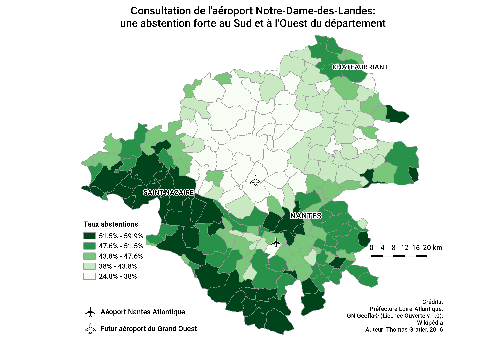
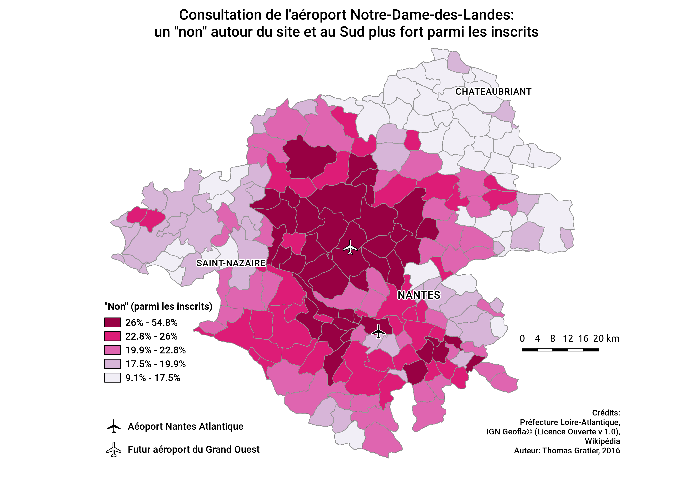
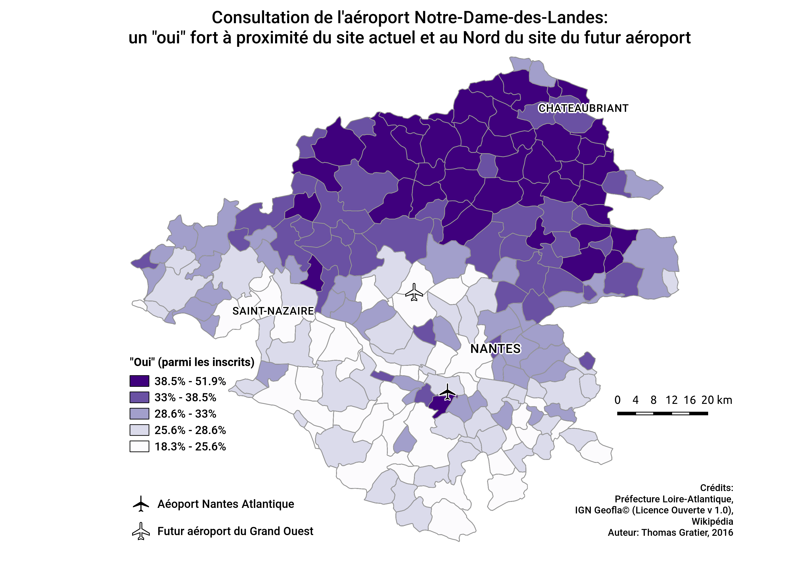

# Données du vote sur le projet d'aéroport de Notre Dame Des Landes (NDDL)

Il s'agit en fait de deux jeux de données.
Le premier concerne toutes les communes de Loire-Atlantique.

## Données départementales

Ces données sont mise à disposition sous forme CSV, plus facilement exploitables que celles publiées par la préfecture, sous forme PDF (http://www.loire-atlantique.gouv.fr/Actualites/Resultats-de-la-consultation-Nddl).

La description des champs est dans le fichier [datapackage.json](datapackage.json)

Merci de référencer les crédits en précisant la source originale "Préfecture de la Loire-Atlantique".

Nous avons aussi récupéré les contours communaux dit "Geofla" de l'IGN (http://professionnels.ign.fr/geofla) sous Licence Ouverte version 1.0 puis avons fait les modifications pour avoir les contours communaux à jour (cet écart s'expliquant par la politique récente des "communes nouvelles")

## Données de la ville de Nantes

La ville de Nantes a publié dans un PDF les résultats par bureau de vote sur http://www.nantes.fr/home/actualites/ville-de-nantes/administration/2016/consultation-aeroport-result.html

Comme précédemment, nous les avons transformées en CSV.

Pour les données des bureaux de vote nantais, les crédits sont Ville de Nantes,  Open Database License (ODbL). Elles ont été récupérées depuis http://data.nantes.fr/donnees/detail/decoupage-geographique-des-bureaux-de-vote-de-la-ville-de-nantes-1/

## Données additionnelles

* Emplacement de l'aéroport Loire-Atlantique actuel
* Emplacement du futur aéroport Notre-Dames-des-Landes

Les crédits sont liés à Wikipédia dans ce cas précis.

## Projet QGIS réexploitable

Vous trouverez un fichier [consultation-nddl-2016-qgis.qgs](consultation-nddl-2016-qgis.qgs) pour réxploiter ces données dans le logiciel Open Source [QGIS](http://qgis.org/fr/site/) au niveau Loire-Atlantique. A vous de jouer sur la ville de Nantes.

Voici quelques aperçus

## Notes

Les jointures entre données attributaires et géographiques sont faites via ce qu'on appelle des couches virtuelles. Les chemins peuvent poser problème pour réutiliser le projet. Pour cela, changez le manuellement en éditant le chemin dans le fichier [consultation-nddl-2016-qgis.qgs](consultation-nddl-2016-qgis.qgs) (bug pour le moment, nous ferons une correction sous peu si aucun alternative simple n'est trouvée rapidement)

